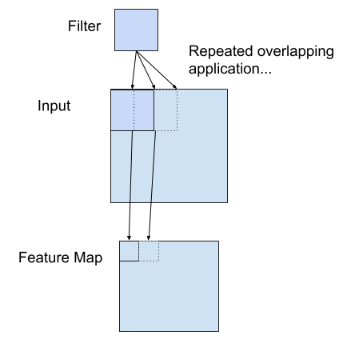
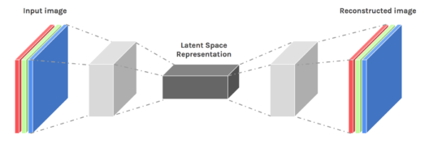
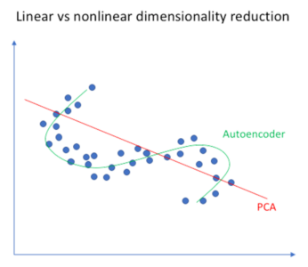
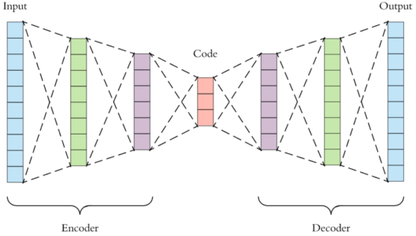

# Traffic Flow Prediction

My ideal goal is to build a service which asks the user to select two points as source and destination on the map and my
service can inform the user how long it takes him to travel from source to destination. This job has so many subtasks
but the hardest and most important one is traffic flow prediction.

# This Is Done Before!!!

Yes, there are apps like google map and more that do the same thing, but after talking to Sina Bakhtiary (routing tech
specialist at snapp) I was assured that it's still one the most valuable jobs to do and can run a business.

# How Is The Job Done At The Moment?

This will take a long time to explain it with details but this is the idea, there are two subsections , first, so many
people have the app on their cellphones and with the access to their GPSs the traffic flow in a certain street can be
estimated periodically, as you can guess this will turn into a time series problem. Second, by remembering the traffic
flow at the same street at the same day and time in previous weeks the app has a historical model that can be used.

# What is the improvement?

My approach is completely different, I'm going to use deep learning to forecast the traffic. In my opinion the best
model is hybrid of smaller ones, some models work better for short-term travels like 15 minutes, and some do better for
long-term travels like 60 minutes.

# Prerequisites

## Convolutional layers in deep learning neural network

A convolution is a linear operation that involves the multiplication of a set of weights with the input. This technique
was designed for two-dimensional input, the multiplication is performed by a two-dimensional array of weights, called a
filter or a kernel. The filter is smaller than the input data, and the type of multiplication applied between a
filter-sized patch of the input and the filter is a dot product. The filter is applied systematically to each
overlapping part or filter-sized patch of the input data, left to right , top to bottom. If the filter is designed to
detect a specific type of feature in the input, then this operation allows the filter an opportunity to discover that
feature anywhere in the image.

**Note**: If you come from a digital signal processing field or related area of mathematics, you may understand the
convolution operation on a matrix as something different. Technically, the convolution as described in the use of
convolutional neural networks is actually a “cross-correlation”. Nevertheless, in deep learning, it is referred to as a
“convolution” operation. 
**Example**: below is a hand crafted 3×3 element filter for detecting vertical lines: 
0.0, 1.0, 0.0 
0.0, 1.0, 0.0 
0.0, 1.0, 0.0 
Applying this filter to an image will result in a feature map that only contains vertical lines. It is a vertical line
detector.

## Autoencoders

Autoencoders are unsupervised neural networks that do compression. This algorithm applies backpropagation, setting the
target values to be equal to the inputs. Autoencoders are used to reduce the size of our inputs into a smaller
representation. If anyone needs the original data, they can reconstruct it from the compressed data.

**Note**: PCA does the same task of compression but autoencoders are preferred because an autoencoder can learn
non-linear transformations with a non-linear activation function and multiple layers.

Autoencoders have many applications like image coloring, feature variation, dimensionality reduction, denoising image
and watermark removal.

### Architecture

1.Encode 
2.Code 
3.Decoder

The decoded image is a lossy reconstruction of the original image. The code part is also known as Bottleneck. There are
four hyperparameters that should be set before training, code size, number of layers, number of nodes per layer and loss
function

### Sparse Autoencoder

A sparse autoencoder tries to ensure the neuron is inactive most of the time so the average activation of a neuron is
close to 0 so on average the neuron is inactive but whenever it is active it is going to adhere to certain patterns

### Stacked Autoencoder

A stacked autoencoder is a neural network consist several layers of sparse autoencoders

## Kullback-Leibler Divergence

Entropy shows how much uncertainty is in our distribution. Cross entropy of two distributions will be zero if they are
the same and will differ by some amount of bits if they are different. KL is cross entropy minus entropy which means how
much two distributions differ.

## Vanishing Gradient Problem

As the number of hidden layers is increased, the amount of error information propagated back to earlier layers is
dramatically reduced. This means that weights in hidden layers close to the output layer are updated normally, whereas
weights in hidden layers close to the input layer are updated minimally or not at all. This problem prevented the
training of very deep neural networks and was referred to as the vanishing gradient problem.

## Greedy Layer-Wise Pretraining in Deep Learning

### Layer-wise term

Pretraining involves successively adding a new hidden layer to a model and refitting, allowing the newly added model to
learn the inputs from the existing hidden layer, often while keeping the weights for the existing hidden layers fixed.
This gives the technique the name “layer-wise” as the model is trained one layer at a time. 

### Greedy

Dividing the training process into a succession of layer-wise training processes is seen as a greedy shortcut that
likely leads to an aggregate of locally optimal solutions, a shortcut to a good enough global solution.

### Supervised and Unsupervised Pretraining

Supervised pretraining involves successively adding hidden layers to a model trained on a supervised learning task.
Unsupervised pretraining involves using the greedy layer-wise process to build up an unsupervised autoencoder model, to
which a supervised output layer is later added.
**Note**: It is almost necessary to fine tune the weights in the network after pretraining. As such, this allows
pretraining to be considered a type of weight initialization method.

## Fine-tuning

## Summary Of The Work

Deep learning algorithms are used to extract inherent features in data and they can discover huge amounts of structure
in the data. As a traffic flow process is complicated in nature, deep learning algorithms can represent traffic features
without prior knowledge. We want to use a stacked autoencoder (SAE) model to learn generic traffic flow features, and it
is trained in a layer-wise greedy fashion.

## Black Box View

## Methodology and Formulations

### Autoencoder

latex

### SAEs

A SAE model is created by stacking autoencoders and then we should add a standard predictor on the top layer. This paper
put a logistic regression layer on top of the network for supervised traffic flow prediction.

### Training Algorithm

The greedy layer-wise unsupervised learning algorithm is used to pretrain the deep network layer by layer in a bottom–up
way. After the pretraining phase, fine-tuning using BP can be applied to tune the model’s parameters in a top–down
direction to obtain better results at the same time. 

#### Pretrain the SAE

- Set the weight of sparsity γ, sparsity parameter ρ, initialize weight matrices and bias vectors randomly. 
- Greedy layer-wise training hidden layers.
- Use the output of the kth hidden layer as the input of the (k + 1)th hidden layer. For the first hidden layer, the
  input is the training set.
- Find encoding parameters {Wk+1 1 , bk+1 1 } l−1 k=0 for the (k + 1)th hidden layer by minimizing the objective
  function .

#### Fine-tuning the whole network

